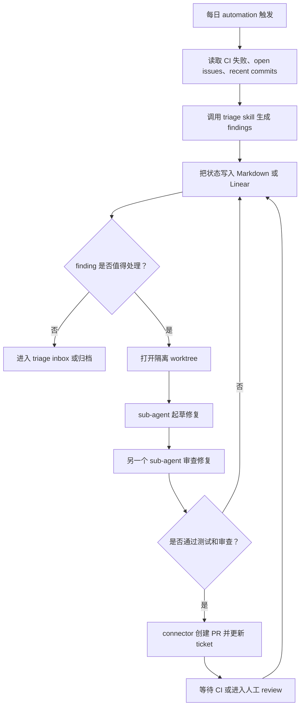

# Loop Engineering：从提示 Agent 到设计 Agent 工作循环

## 文档信息

- 主题：Addy Osmani 对 **Loop Engineering** 的解释
- 来源：用户粘贴的文章文本，原文指向 Addy Osmani 的 X Article
- 原文链接：https://x.com/i/article/2064122477731852288
- 整理日期：2026-06-12
- 文档目的：帮助理解文章主旨、关键概念、工具映射、工程启发和风险边界

## 一句话理解

这篇文章的核心观点是：使用 coding agent 的关键能力，正在从“人不断写 prompt 指挥 agent”转向“人设计一个能自动发现任务、分派任务、检查结果、记录状态并继续推进的工作循环”。

作者把这种能力称为 **Loop Engineering**。

## 文章真正想讨论的问题

过去两年，使用 coding agent 的主要方式是：

1. 人写一个 prompt。
2. agent 返回结果或修改代码。
3. 人阅读结果。
4. 人继续写下一条 prompt。

这种模式里，人是流程的发动机。agent 是工具，人一轮一轮地握着它操作。

作者认为，这个模式正在变化。更高杠杆的方式不是继续优化每一条 prompt，而是设计一个系统，让系统自己去推动 agent：

- 系统发现今天有什么工作要做。
- 系统把任务分配给 agent。
- 系统检查 agent 的输出。
- 系统记录已经完成和没有完成的事情。
- 系统决定下一步。
- 系统在下一次运行时接着推进。

所以，文章不是在说 prompt 不重要，而是在说：**prompt 不再是唯一的杠杆点，loop 的设计正在成为新的杠杆点。**

## Prompt Engineering 与 Loop Engineering 的区别

| 维度 | Prompt Engineering | Loop Engineering |
| --- | --- | --- |
| 关注对象 | 单轮或少数几轮对话 | 可持续运行的工作流程 |
| 人的角色 | 每一步都手动提示 agent | 设计系统，让系统提示 agent |
| 状态管理 | 大多依赖当前上下文 | 依赖外部 memory、文件、issue 或看板 |
| 质量控制 | 人每轮检查 | maker/checker 分离，sub-agent 辅助检查 |
| 工具接入 | 通常围绕代码和文件 | 接入 issue、CI、PR、Slack、Linear 等真实工具 |
| 风险 | prompt 写得不好，单次结果差 | loop 失控、成本上升、质量债和理解债扩大 |

Prompt Engineering 解决的是：“这一轮我要怎么说，agent 才能做对？”

Loop Engineering 解决的是：“我要设计怎样的系统，让 agent 能持续、可检查、可恢复地推进工作？”

## 作者给出的 loop 六个组成部分

文章说，一个 loop 大致需要五个构件，再加一个 memory。

### 1. Automations：loop 的心跳

Automations 让 loop 不只是一次手动运行，而是能够按节奏自动运行。

典型任务包括：

- 每天检查 issue。
- 总结 CI 失败。
- 阅读最近提交。
- 找出可能引入的 bug。
- 生成 triage 结果。
- 把需要人处理的内容放进 inbox。

没有 automation，loop 就只是一次执行。有了 automation，loop 才真正开始“循环”。

### 2. Worktrees：避免并行 agent 互相踩文件

只要多个 agent 同时改一个 repo，就会出现文件冲突。

worktree 的作用是给每个 agent 一个独立工作区：

- 每个 agent 在自己的 branch 或 checkout 中工作。
- 一个 agent 的改动不会直接覆盖另一个 agent。
- 并行探索、并行修复、并行实验变得更可控。

作者也提醒：worktree 只解决机械冲突，不解决人的审查能力上限。真正限制并行规模的，仍然是工程师能审多少、能理解多少。

### 3. Skills：把项目知识外化

skill 的意义是：不要每次都重新向 agent 解释项目。

skill 可以记录：

- 项目结构。
- 构建方式。
- 测试方式。
- 代码约定。
- 历史坑点。
- 不应该做的设计。
- 某类任务的标准流程。

没有 skill，agent 每次启动都像冷启动，会用猜测填补上下文空白。文章把这和 **intent debt** 联系起来：人的意图没有被写下来，就会反复消耗在每一次对话里。

有 skill，loop 每次运行都可以读取稳定的项目知识，减少重复解释和错误猜测。

### 4. Plugins 和 Connectors：让 loop 进入真实工作环境

如果 agent 只能看文件系统，它能做的事情很有限。

connectors 让 agent 能连接真实工具，例如：

- GitHub
- Linear
- Slack
- CI 系统
- 数据库
- staging API
- issue tracker

这让 loop 从“告诉你应该怎么做”变成“直接在真实流程里行动”。

区别在于：

- 普通 agent 可能只会说：“这里是修复建议。”
- 接入工具的 loop 可以：“创建 PR，关联 ticket，CI 通过后通知频道。”

### 5. Sub-agents：让写的人和检查的人分开

作者认为，在 loop 中最重要的结构之一，是把 maker 和 checker 分开。

原因是：写代码的 agent 不适合给自己的输出打分。它可能会过度相信自己的结果。

更好的结构是：

- 一个 agent 探索问题。
- 一个 agent 实现修复。
- 一个 agent 根据 spec、skill 和测试进行验证。

这种结构特别适合无人值守或半自动 loop。因为人没有一直盯着时，必须有一个更可信的检查环节。

但 sub-agent 会消耗更多 token。作者的态度不是无限使用，而是把它用在值得付出成本的地方，例如安全审查、复杂重构、长期自动化任务的验收。

### 6. Memory：让 loop 记住上一次做到了哪里

memory 是文章里非常关键的一点。

模型在两次运行之间会忘记上下文，所以状态不能只放在对话里。状态应该存在外部：

- Markdown 文件
- Linear board
- issue tracker
- repo 中的状态文件

memory 要记录：

- 已经尝试过什么。
- 什么通过了。
- 什么失败了。
- 什么还没做。
- 下一步是什么。

作者的核心判断是：agent 会忘，但 repo 不会。

## 一个完整 loop 的样子

文章给出的典型 loop 可以整理成这样：

这个 loop 的重点不是某一个 agent 多聪明，而是整套流程形成了闭环：

- 有触发。
- 有输入。
- 有分派。
- 有隔离。
- 有验证。
- 有记忆。
- 有输出。
- 有下一轮。

## 文章中的工具映射

文章认为 Codex 和 Claude Code 已经具备相近的构件，只是名字和入口不同。

| 能力 | 文章中提到的 Codex 形态 | 文章中提到的 Claude Code 形态 |
| --- | --- | --- |
| 定时运行 | Automations | `/loop`、cron、hooks、GitHub Actions |
| 持续到目标完成 | `/goal` | `/goal` |
| 并行隔离 | 内置 worktree 支持 | git worktree、`--worktree`、subagent isolation |
| 项目知识 | Skills | Skills |
| 工具接入 | Plugins、connectors、MCP | MCP、plugins/connectors |
| 多 agent 协作 | `.codex/agents/` subagents | `.claude/agents/` subagents、agent teams |

作者想表达的不是某个工具独占未来，而是：当不同工具都长出相似能力时，真正重要的是设计一个跨工具也成立的 loop。

## 作者强调的风险

文章后半部分并不是单纯鼓吹自动化。作者很明确地提醒：loop 会放大能力，也会放大问题。

### 1. 验证责任仍然在人

无人值守运行的 loop，也可能无人值守地犯错。

sub-agent verifier 能提升可信度，但它不能把“完成了”变成绝对证明。最终你仍然要确认代码真的工作。

### 2. 理解债会变严重

loop 越快地产出你没有亲手写的代码，你和系统真实状态之间的差距就可能越大。

如果你不阅读、不理解 loop 产出的东西，系统会越来越不是你真正掌握的系统。

作者把这称为 comprehension debt。

### 3. 自动化可能导致认知投降

当 loop 很顺时，人容易变成只接收结果的人。

这很危险。因为工程师不再判断，只是接受机器给出的输出。

作者把这种状态称为 cognitive surrender。

同一个 loop，在不同人手里会产生完全不同的结果：

- 一个理解系统的人，用它加速高质量工作。
- 一个逃避理解的人，用它更快地产出自己无法判断的东西。

loop 本身不知道这两者的区别，但工程师知道。

## 对工程师的启发

这篇文章对工程师最重要的提醒是：未来的竞争点可能不是“我会不会用 AI 写代码”，而是：

- 我能不能把重复工作流程化？
- 我能不能把项目知识沉淀成 skill？
- 我能不能设计可靠的验证环节？
- 我能不能把 agent 接入真实工具链？
- 我能不能控制并行任务的 review 成本？
- 我能不能在自动化提高速度的同时保持理解？

Loop Engineering 本质上是把工程师从“每一步手动操作的人”，推向“工作系统设计者”。

但这不意味着工程师被删除了。相反，工程师的判断更重要了。

## 可以怎么落地一个小 loop

一个保守的起步方式，不是立刻让 agent 自动改代码，而是先做只读 loop。

例如：

1. 每天早上自动读取昨天的 CI 失败。
2. 读取最近合入的 commits。
3. 读取 open issues。
4. 调用一个 triage skill，输出问题分类。
5. 把结果写进 Markdown 文件。
6. 人工决定哪些值得处理。

这个阶段的 loop 不直接改代码，风险较低，但能验证：

- automation 是否可靠。
- skill 是否写得清楚。
- 状态文件是否有用。
- 输出是否能节省人的判断时间。

等这个只读 loop 稳定后，再引入：

- 独立 worktree。
- sub-agent 起草修复。
- sub-agent 审查。
- 自动创建 PR。
- 人工最终 review。

## 复盘问题

读完这篇文章，可以用这些问题检查自己是否真正理解：

1. 我现在使用 agent 时，是在不断 prompt，还是已经在设计 loop？
2. 我的项目知识有没有沉淀成 skill，还是每次都靠临时解释？
3. 如果让 agent 每天自动运行，它应该把状态写在哪里？
4. 哪些任务适合只读 automation，哪些任务可以进入自动修复？
5. 我有没有把 maker 和 checker 分开？
6. 我能承受多少个并行 worktree 的 review 成本？
7. 哪些 connector 能让 agent 从“建议”进入“行动”？
8. 我如何避免自己对系统理解变浅？
9. loop 的停止条件是否可验证？
10. 如果 loop 犯错，谁能发现，怎么回滚？

## 最后的关键句

文章最后的核心可以概括为：

> Build the loop. Stay the engineer.

可以构建 loop，可以自动化，可以让 agent 并行工作，也可以让系统替你发现和推进任务。

但你不能退化成只按下 go 的人。你仍然要理解系统、审查结果、承担质量责任。

